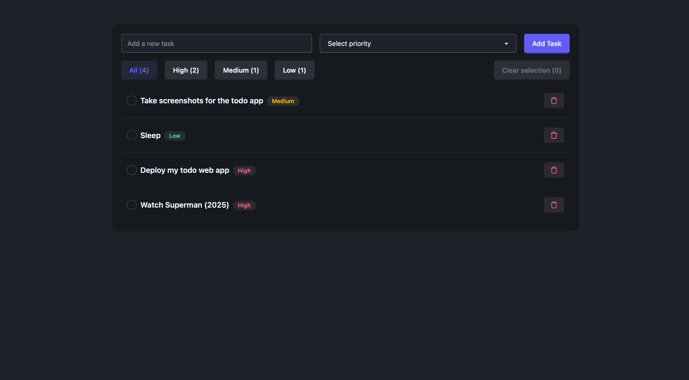

# 📝 React Priority Todo App

A simple yet functional Todo list application built with **React**, **TypeScript**, and **Tailwind CSS**, allowing users to:

- Add tasks with a selected **priority** (Low, Medium, High)
- Filter tasks by priority level
- Persist tasks locally in the browser
- Select and delete multiple tasks efficiently


## 🚀 Live Demo

Check out the live version of the app hosted on Vercel:

🔗 https://todo-tan-psi-74.vercel.app

## 🚀 Features

- Create tasks with a title and priority
- Filter tasks by priority (All, High, Medium, Low)
- Persistent storage using `localStorage`
- Multi-select support for bulk deletion
- Delete individual tasks
- Responsive UI with Tailwind CSS
- Icon support via [lucide-react](https://lucide.dev)


## 🧱 Components
### `App.tsx`

Main application component:
- Handles task creation, filtering, local storage, and selection logic
- Renders UI for adding tasks and displays filtered task lists
- Manages global task state and interactions

### `TodoItem.tsx`
Reusable todo item component:
- Displays task text and priority badge
- Includes checkbox for selection
- Delete button using the `Trash` icon from `lucide-react`

#### Example UI from `TodoItem`:
```tsx
<TodoItem 
  todo={todo}
  onDelete={() => deleteTodo(todo.id)} 
  isSelected={selectedTodos.has(todo.id)}
  onSelect={() => toggleSelectTodo(todo.id)}
/>
```

## 🧑‍💻 Getting Started
### Prerequisites

- Node.js (v16+)
- A package manager like npm, yarn, or pnpm

### Installation
```bash
git clone https://github.com/your-username/priority-todo-app.git
cd priority-todo-app
npm install
```

### Running the App
```bash
npm run dev
```

### Building for Production
```bash
npm run build
```

## 📸 Screenshots

Here's what the app looks like with tasks added:



Here's what the list looks like when filtered by priority:


## 📦 Tech Stack
- React – UI Library
- TypeScript – Static typing
- Tailwind CSS – Utility-first styling
- Lucide React – Beautiful SVG icons
- LocalStorage – Data persistence

## Acknowledgements

This project was built following the tutorial by [faizdev](https://www.youtube.com/watch?v=jzN-Do26Umw&ab_channel=Faizdev).  
All credit goes to them for the original idea and guidance.